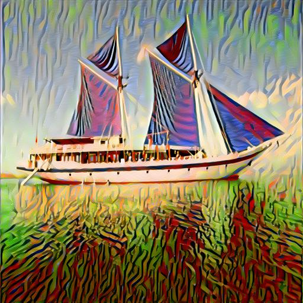
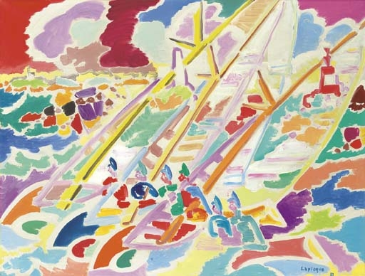
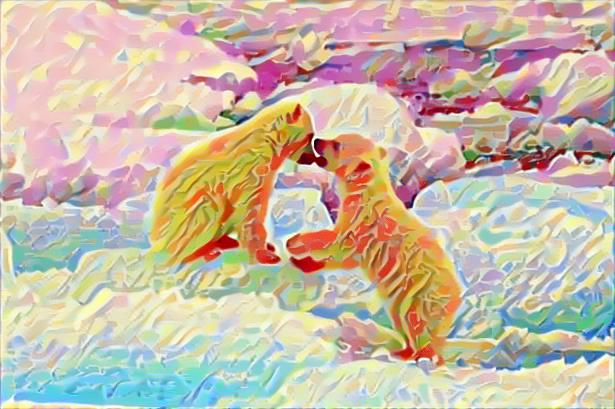
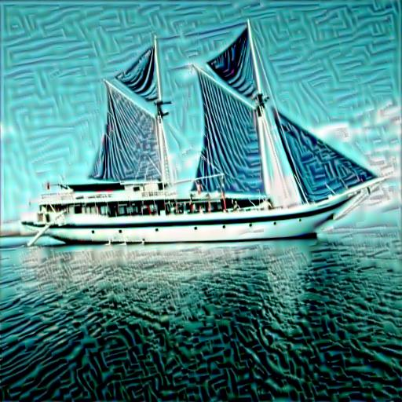
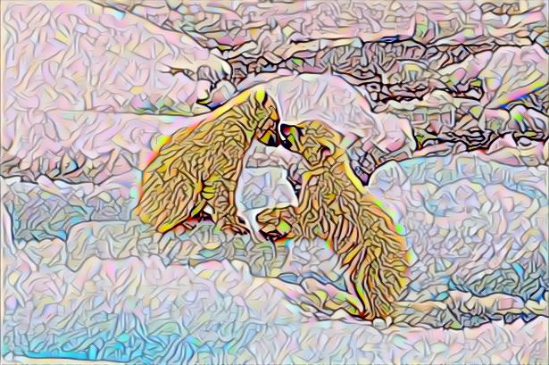
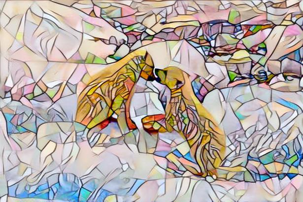

# Neural Style Transfer with Structure Loss (NST+ImagineNet)
This is a Pytorch implementation of the "Structure Loss" from the paper [ImagineNet: Restyling Apps Using Neural Style Transfer](https://arxiv.org/abs/2001.04932) integrated into the Neural Style Transfer method of Gatys et al. from the paper [A Neural Algorithm of Artistic Style](https://arxiv.org/abs/1508.06576).

Big thanks to Pytorch's official tutorial of [Neural Style Transfer](https://pytorch.org/tutorials/advanced/neural_style_tutorial.html).

## What is NST algorithm?
The algorithm produces an optimized image taking its style from the **style image** and content from the **content image** using pretrained CNN nets (usually VGG-16/19).

### Loss Functions
#### Loss Functions in Original NST
The original NST method uses two different losses, which our minimized using a optimizer:
* **Content Loss**: Uses feature maps from a specified layer of the CNN, to match the content of the output with the content image.
* **Style Loss**: Uses Gram Matrices of feature maps from specified layers of the CNN, to match the style of the output with the style image.
#### Aditional Loss Functions in this repo
This repo adds two new loss functions:
* **Structure Loss**: Introduced in the [ImagineNet](https://arxiv.org/abs/2001.0493) paper, this uses Cross Covariance matrices of features maps from specified pairs of layers of the CNN. The idea is to model the correlation of textures across layers of the CNN, which they refer to as **_Structure_**.
* **Total Variation Loss**: Uses adjacent pixels of the image being optimized, to make it smoother.

## Examples

Take a look at some of the results:
<p align="center">
 
  

</p>
<p align="center">
 
  

</p>
<p align="center">
 
  

</p>

### Difference between results of the original NST and NST+ImagineNet
The difference between the results of the original NST and this implementation is that:
* The Structure loss pushes the output to have a more homogenoues style representation throughout the image.
* It also better conserves the semantics of the content from the content image.   

Take a look at a comparison of results (left: Style Image, Middle: NST+ImagineNet, Right: Original NST):
<p align="center">
  
  
</p>

## Usage
Just open the notebook `imagine-style-transfer.ipynb` in Google Colab and follow the instructions given in it.

## Citation

If you find this code useful for your research, please cite the following:

```
@misc{Javed2020imaginenst,
  author = {Javed, Muhammad Gohar},
  title = {nst-imaginenet},
  year = {2020},
  publisher = {GitHub},
  journal = {GitHub repository},
  howpublished = {\url{https://github.com/gohar-malik/nst-imaginenet}},
}
```
## Licence

[](https://github.com/gohar-malik/nst-imaginenet/blob/master/LICENSE)
